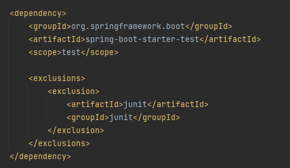

= Good to know:

if it is like that in pom.xml:

<dependency>
<groupId>org.springframework.boot</groupId>
<artifactId>spring-boot-starter-test</artifactId>
<scope>test</scope>

			<exclusions>
				<exclusion>
					<artifactId>junit</artifactId>
					<groupId>junit</groupId>
				</exclusion>
			</exclusions>
		</dependency>

and we don't need junit vintage (we can delete it from pom.xml) and in this case JUnit4 disappears from the maven list at all!